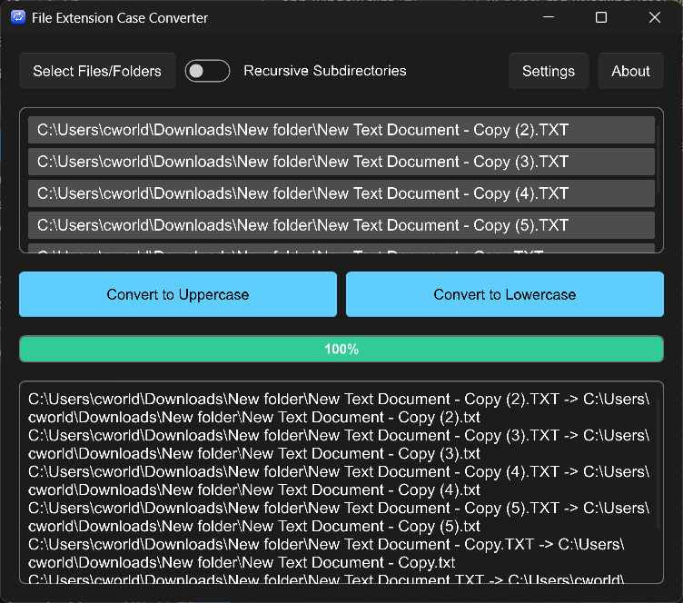

<div align="center">
   
</div>

# File Extension Case Converter

A simple tool to convert file extension cases between uppercase and lowercase 🔄

[](https://github.com/cworld1/ext-case-converter/blob/main/LICENSE)

## Introduction

This application helps you batch convert file extensions between uppercase and lowercase formats. Built with Rust and Slint UI framework, it provides a clean and intuitive interface for managing file extension cases.



## Features

- **Batch Processing**: Convert multiple files at once
- **Recursive Directory Support**: Process files in subdirectories 
- **Drag & Drop Interface**: Simply drag files or folders into the application
- **Multilingual Support**: Available in English and Chinese
- **Cross-Platform**: Works on Windows, macOS, and Linux
- **Safe Operations**: Preview changes before applying them

## Local Development

### Prerequisites

1. Install Rust by following its [getting-started guide](https://www.rust-lang.org/learn/get-started).
   Once this is done, you should have the `rustc` compiler and the `cargo` build system installed in your `PATH`.

### Setup

Clone the repository and navigate to the project directory:

```bash
git clone https://github.com/cworld1/ext-case-converter.git
cd ext-case-converter
```

### Development Server

Build and run the application:

```bash
# Build the project
cargo build

# Run the application
cargo run
```

For development with hot reload and better debugging experience:

```bash
cargo run --features dev
```

## Production

Build the application for production:

```bash
# Release build
cargo build --release

# The executable will be available at:
# target/release/slint-rust-template.exe (Windows)
# target/release/slint-rust-template (Unix)
```

### IDE Integration

We recommend using an IDE for development, along with [LSP-based IDE integration for `.slint` files](https://github.com/slint-ui/slint/blob/master/tools/lsp/README.md). You can also load this project directly in [Visual Studio Code](https://code.visualstudio.com) and install the [Slint extension](https://marketplace.visualstudio.com/items?itemName=Slint.slint).

## Technical Stack

- **Backend**: Rust
- **UI Framework**: [Slint](https://slint.rs/)
- **File Handling**: `walkdir` for recursive directory traversal
- **File Dialogs**: `rfd` for native file selection dialogs
- **Configuration**: TOML-based configuration system
- **Internationalization**: Built-in gettext support

## Project Structure

```
├── src/
│   ├── main.rs           # Application entry point
│   ├── config.rs         # Configuration management
│   ├── file_handler.rs   # File processing logic
│   └── ui_handlers.rs    # UI event handlers
├── ui/
│   ├── main.slint        # Main UI components
│   ├── app-window.slint  # Application window
│   ├── settings.slint    # Settings dialog
│   └── about.slint       # About dialog
├── lang/                 # Translation files
│   ├── zh_CN/            # Chinese translations
│   └── en_US/            # English translations
└── target/               # Build artifacts
```

## Contributions

To spend more time coding and less time fiddling with whitespace, this project uses code conventions and styles to encourage consistency. Code with a consistent style is easier (and less error-prone!) to review, maintain, and understand.

### Development Guidelines

- Follow Rust standard formatting with `cargo fmt`
- Run `cargo clippy` to catch common mistakes
- Ensure all tests pass with `cargo test`
- Update translations when adding new UI text

## License

This project is licensed under the GPL-3 License.
